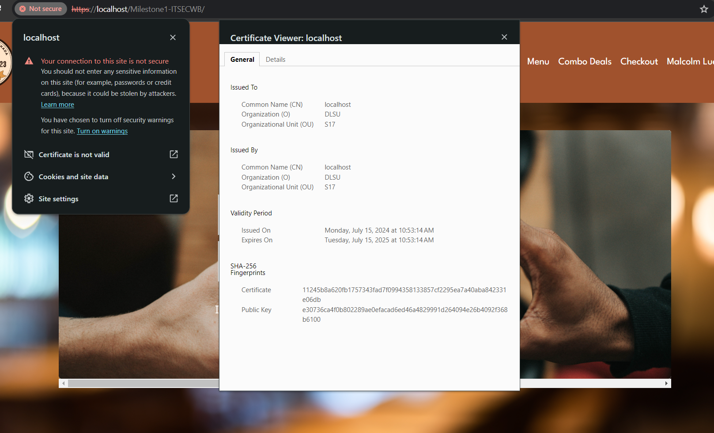

First open a file explorer and goto XAMP/apache/config
open ssl.crt, ssl.key, and ssl.csr
and remove the initial files named "server"
go back to folder \uploads and cut server.crt and go back to folder \ssl.crt and paste
go back to folder \uploads and cut server.key and go back to folder \ssl.key and paste
no need to do anything for folder /ssl.csr because it is not needed
after doing this restart apache in XAMPP control panel then goto https://localhost/Milestone1-ITSECWB/ you will have to press advance then to continue to localhost(unsafe).
You can check if it works by pressing the not secure on the left side of the web address and press certifcate is not valid to check the details
 Delete image.png after  checking

DO NOT DELETE /uploads it is needed for image uploading when user signs up